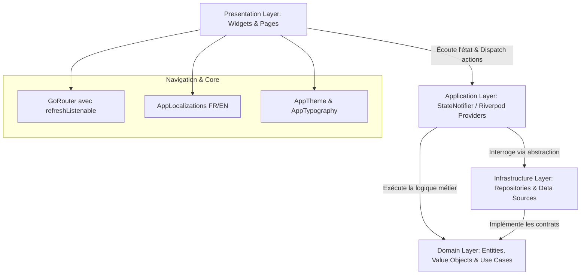

# 🎓 SmartClass — Plateforme Intelligente & Collaborative d'Apprentissage

[](https://flutter.dev)
[](https://dart.dev)
[](https://riverpod.dev)
[](https://pub.dev/packages/go_router)
[](https://blog.cleancoder.com/uncle-bob/2012/08/13/the-clean-architecture.html)
[]()

**SmartClass** est une application mobile et multiplateforme (iOS, Android, Web, Desktop) conçue pour moderniser l'enseignement supérieur et secondaire. Elle combine des outils de gestion pédagogique, la génération de cours et d'évaluations par **Intelligence Artificielle**, la visioconférence collaborative et le suivi de progression en temps réel dans une interface soignée inspirée des **Apple Human Interface Guidelines** et du design system académique **Academic Precision**.

---

## 📑 Sommaire

- [👥 Aperçu & Personas](#-aperçu--personas)
- [🏛️ Architecture Logicielle & Flux de Données](#️-architecture-logicielle--flux-de-données)
- [🎨 Design System (Academic Precision)](#-design-system-academic-precision)
- [🚀 Fonctionnalités Clés & Composants Stitch UI](#-fonctionnalités-clés--composants-stitch-ui)
  - [1. Tableau de bord Étudiant (Salma)](#1-tableau-de-bord-étudiant-salma)
  - [2. Tableau de bord Enseignant (Prof. Amine)](#2-tableau-de-bord-enseignant-prof-amine)
  - [3. Créateur de Cours Assisté par IA](#3-créateur-de-cours-assisté-par-ia)
  - [4. Authentification & Sécurité](#4-authentification--sécurité)
- [💻 Installation & Démarrage Rapide](#-installation--démarrage-rapide)
- [⚡ Accès Démo 1-Clic](#-accès-démo-1-clic)
- [🧪 Qualité de Code, Lint & Tests](#-qualité-de-code-lint--tests)
- [📁 Structure Complète du Répertoire](#-structure-complète-du-répertoire)

---

## 👥 Aperçu & Personas

SmartClass adapte dynamiquement son expérience utilisateur selon 3 profils cibles :

1. **🎓 Salma — Étudiante (20 ans, Licence 3 Informatique)** :
   - Suivi visuel des cours en cours et pourcentage d'avancement.
   - Alerte de classe virtuelle en direct (`LIVE IMMINENT`) avec accès direct en 1 clic.
   - Studio IA pour réviser (synthèse de fiches mémo et quiz d'entraînement interactifs).
   - Suivi des devoirs urgents et validation automatique par IA.
2. **👨‍🏫 Amine — Enseignant (35 ans, Professeur d'Université)** :
   - Cockpit de suivi des cohortes et de l'assiduité des étudiants.
   - Lancement et planification des cours magistraux et TD en visio.
   - Créateur de cours assisté par IA avec découpage en chapitres et exercices.
3. **🛡️ Karim — Administrateur de la Plateforme** :
   - Supervision des cohortes, affectation des enseignants et rapports d'intégrité anti-fraude.

---

## 🏛️ Architecture Logicielle & Flux de Données

Le projet applique une **Clean Architecture stricte en 4 couches** pour garantir la pérennité, la testabilité unitaire et l'indépendance vis-à-vis des frameworks :



### Principes Directeurs
- **Zéro texte hardcodé** : Tout texte passe obligatoirement par `context.tr('clé')` dans `AppLocalizations`.
- **Zéro taille de police en dur** : Typographie centralisée sur `theme.textTheme` et configurable dynamiquement par l'utilisateur depuis les Paramètres.
- **Navigation réactive stable** : `GoRouter` instancié une seule fois avec `refreshListenable: AuthRefreshNotifier` pour éviter les pertes d'état lors des mutations d'authentification.
- **Données simulées isolées** : Données mockées exclusivement logées dans `infrastructure/datasources/` et injectées par Riverpod.

---

## 🎨 Design System (Academic Precision)

La charte visuelle est détaillée dans [`DESIGN.md`](./DESIGN.md) et synchronisée avec les maquettes Stitch UI :

| Jeton / Token | Valeur Hex / Config | Rôle / Utilisation |
|---|---|---|
| **Primary** | `#122675` / `#2D3E8C` | Actions prioritaires, navigation, focus académique |
| **Secondary** | `#4056B9` / `#8197FF` | Accents, barres de progression, commutateurs |
| **Tertiary** | `#003627` / `#0F9D78` | Succès, streaks d'étude, badges de validation |
| **Surface** | `#FAF8FF` / `#F7F8FB` | Fond adouci anti-éblouissement |
| **Cards** | `#FFFFFF` | Cartes blanches avec bordure hairline `rgba(45, 62, 140, 0.08)` |
| **Typographie** | Inter | Police native sans-serif avec tracking négatif optique |
| **Coins arrondis** | `8px` (inputs/boutons), `16px` (cartes), `9999px` (pills) | Formes continues inspirées d'iOS |

---

## 🚀 Fonctionnalités Clés & Composants Stitch UI

### 1. Tableau de bord Étudiant (Salma)
*Fidèle au design Stitch UI (`projects/17270414213026740695`)*

| Composant | Fichier source | Description & Détails UI |
|---|---|---|
| **Header Salutation** | [`student_greeting_header.dart`](lib/features/home/presentation/widgets/student_greeting_header.dart) | Avatar Salma avec puce de présence en ligne verte, mention *Licence 3 Informatique*, et cloche de notifications avec badge rouge `2`. |
| **Motivation Cards** | [`student_motivation_cards.dart`](lib/features/home/presentation/widgets/student_motivation_cards.dart) | Carte 🔥 **Série active** (*5 jours consécutifs*) et Carte 🎯 **Objectif hebdo** (*85% atteint*) avec jauge de progression. |
| **Live Imminent** | [`student_imminent_live_card.dart`](lib/features/home/presentation/widgets/student_imminent_live_card.dart) | Bannière avec puce rouge pulsante en direct, cours de *Systèmes Distribués*, horaire (*14h00 · Dans 15 min*), pile d'avatars de camarades (`YM`, `TL`, `KB`, `+18`) et bouton CTA `Rejoindre le Live`. |
| **Studio IA** | [`student_ai_studio_card.dart`](lib/features/home/presentation/widgets/student_ai_studio_card.dart) | Carte dégradée violette/indigo : Synthèse de fiches de cours (`Générer ✨`) et Quiz d'entraînement interactif (`Créer ⚡`). |
| **Mes Cours** | [`student_courses_section.dart`](lib/features/home/presentation/widgets/student_courses_section.dart) | Grille de cours : *Python Avancé* (75%), *Bases de données SQL* (60%), *Architecture Logicielle* (40%) avec badges d'avancement et jauges de progression. |
| **Prochains Devoirs** | [`student_assignments_section.dart`](lib/features/home/presentation/widgets/student_assignments_section.dart) | Cartes d'urgences : *QCM Chapitre 2* (Avant 23h59), *Mini-Projet Python* (Badge IA, Déposer) et *Contrôle Continu Mathématiques*. |
| **Vue Principale** | [`student_dashboard_view.dart`](lib/features/home/presentation/widgets/student_dashboard_view.dart) | Orchestration avec `RefreshIndicator`, contrainte de largeur adaptative (`maxWidth: 640`) et espacements 8pt. |

### 2. Tableau de bord Enseignant (Prof. Amine)
- Métriques clés en temps réel : Étudiants inscrits, cours actifs, copies en attente de correction.
- Accès direct au prochain cours magistral en visio.
- Bannière instantanée de génération de contenu de cours assistée par IA.
- Gestion des classes assignées avec taux de complétion moyen.

### 3. Créateur de Cours Assisté par IA
- Saisie guidée de prompt pédagogique avec suggestions intelligentes.
- Sélecteur de matière et de niveau d'études (ex. *Licence 3 Informatique*).
- Options pédagogiques (génération de quiz, adaptation du ton pédagogique).
- Découpage automatique en chapitres et unités d'enseignement conformes au système LMD.

### 4. Authentification & Sécurité
- Connexion sécurisée avec validation des formats d'email institutionnels.
- Réinitialisation de mot de passe avec code de vérification OTP.
- Onboarding guidé avec sélection de rôle et configuration initiale du profil.

---

## 💻 Installation & Démarrage Rapide

### Prérequis
- [Flutter SDK](https://docs.flutter.dev/get-started/install) (version 3.12 ou supérieure)
- Dart SDK 3.x
- Navigateur Web moderne (Google Chrome ou Microsoft Edge) ou émulateur Android / iOS

### 1. Installer les dépendances
```bash
flutter pub get
```

### 2. Lancer l'application

#### Sur navigateur Web (Recommandé pour tester immédiatement)
```bash
flutter run -d chrome
# ou
flutter run -d edge
```

#### Sur Windows Desktop
```bash
flutter run -d windows
```

#### Sur Mobile (Émulateur ou appareil connecté via USB)
```bash
flutter run
```

### 3. Raccourcis Utiles pendant l'Exécution
- Appuyez sur **`r`** : Rechargement à chaud (*Hot Reload*).
- Appuyez sur **`R`** : Redémarrage à chaud (*Hot Restart*).
- Appuyez sur **`q`** : Quitter l'application.

---

## ⚡ Accès Démo 1-Clic

Pour faciliter la revue et les tests sans devoir créer un compte :

1. Lancez l'application. La page de connexion [`login_page.dart`](lib/features/authentication/presentation/pages/login_page.dart) s'affiche.
2. Sous le bouton de connexion, une boîte dédiée **Accès Démo Rapide** est disponible :
   - Cliquez sur **🎓 Étudiant (Salma)** pour ouvrir instantanément le **Tableau de bord Étudiant**.
   - Cliquez sur **👨‍🏫 Enseignant** pour ouvrir instantanément le **Tableau de bord Enseignant**.
3. Pour tester le flux complet de création de compte, cliquez sur **S'inscrire** et suivez l'onboarding.

---

## 🧪 Qualité de Code, Lint & Tests

Le projet est configuré avec des règles de lint strictes ([`analysis_options.yaml`](./analysis_options.yaml)) garantissant un code propre et sans avertissements :

```bash
# Vérifier la conformité du code (0 erreurs)
flutter analyze

# Lancer la suite complète de tests unitaires et widgets
flutter test

# Régénérer le code si les modèles ou providers sont modifiés
flutter pub run build_runner build --delete-conflicting-outputs
```

---

## 📁 Structure Complète du Répertoire

```
SmartClass/
├── assets/images/                              # Assets graphiques (avatars, logos...)
├── lib/
│   ├── app/
│   │   ├── app.dart                            # Point d'entrée MaterialApp.router & thèmes
│   │   └── app_providers.dart                  # Router GoRouter, AuthNotifier & providers
│   ├── core/
│   │   ├── constants/                          # Constantes applicatives
│   │   ├── localization/app_localizations.dart # Système de traduction FR/EN (context.tr)
│   │   ├── theme/app_theme.dart                # Thème Material 3 Academic Precision
│   │   ├── typography/                         # Gestionnaire typographique dynamique
│   │   └── widgets/                            # Boutons, cartes, champs de saisie
│   └── features/
│       ├── authentication/                     # Login, register, sélection de rôle, OTP
│       │   └── presentation/pages/login_page.dart
│       └── home/
│           ├── application/providers/          # student_dashboard_provider.dart
│           ├── infrastructure/datasources/     # mock_student_dashboard_datasource.dart
│           └── presentation/
│               ├── pages/home_page.dart        # Routeur de dashboard selon rôle
│               └── widgets/                    # Composants modulaires du dashboard étudiant
├── test/                                       # Tests unitaires et tests de widgets
├── DESIGN.md                                   # Spécifications du design system Stitch UI
└── PROJECT_CONTEXT.md                          # Cahier des charges et personas du projet
```

---

## 📄 Licence

Ce projet est la propriété exclusive de SmartClass Education. Tous droits réservés.
